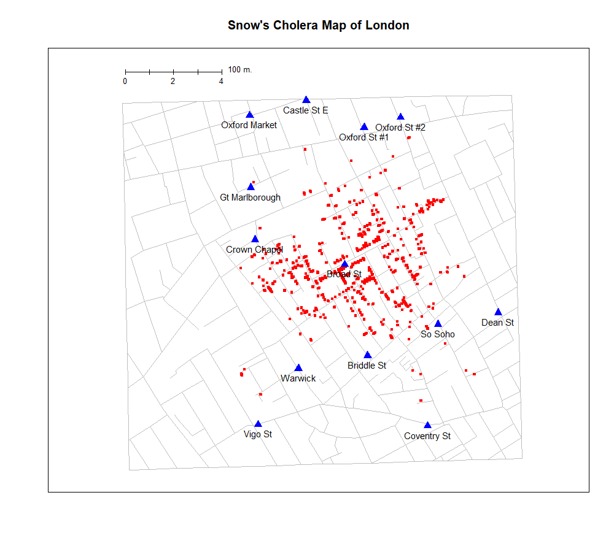
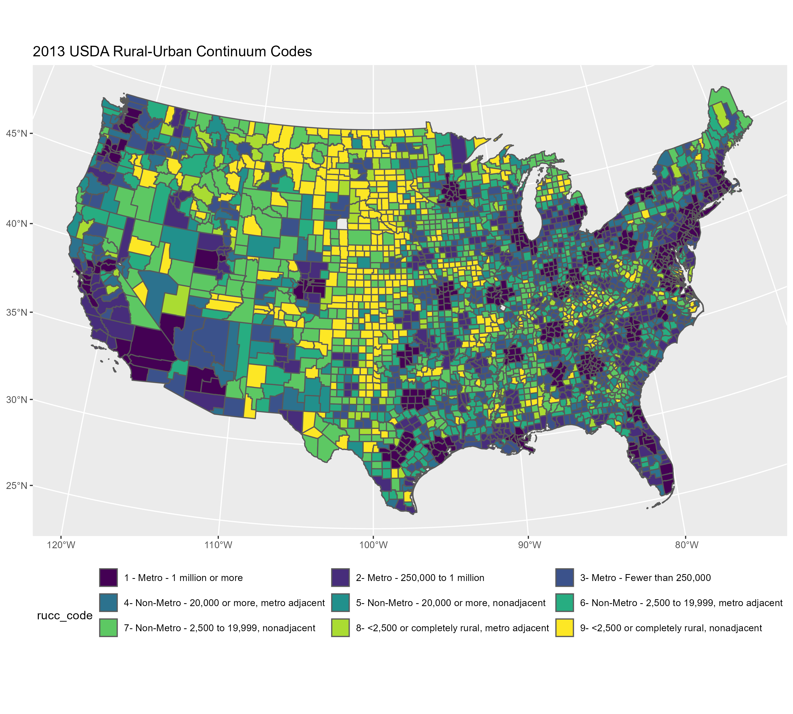
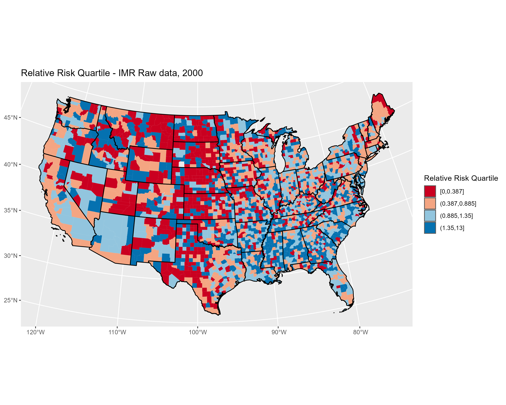
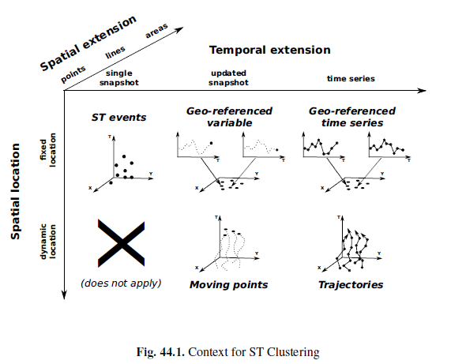

# Presentation Structure

- Spatial and temporal demography
- Data sources
- Modeling strategies
- Results & visualizations
- Wrap up


---

.center[]

---
class: center, inverse

.center[]

---
class: center, inverse

.center[]

---

# Spatial Demography

-  "Putting people into place" (Entwisle, 2007)
  + Need to think about:
  + Context
  + Dynamics
  + Processes

--

- Macro - demography (Voss, 2007)
  + Places as observations
  + Pre - 1960's
  + Ecological inference
 
--

- Micro - demography
  + People as observations
  + Social theory
  + Individual choices
  
--

- Multilevel - demography
  + People in places
  + Interaction between context and behavior


---

# Space & Time

- [Future directions in spatial demography](https://escholarship.org/uc/item/7xx3k2z4) report
  + Most participants listed time or temporal data as integral to the future of the field


--
- Time allows for dynamics of humans and environment
  + Snap shots/cross sections tell us nothing of this


---
class: center, middle
## Space & Time data models 




[Kisilevich et al 2010](https://link-springer-com.libweb.lib.utsa.edu/chapter/10.1007/978-0-387-09823-4_44)

---

## Complexities

- Humans, I mean c'mon
```{r, echo=FALSE,warning=FALSE, message=FALSE, out.width="75%"}
library(ggplot2); library(cowplot)

p1<-ggdraw()+draw_image("hurricane.jpg", scale = .9)
p2<-ggdraw()+draw_image("hwy.jpg", scale = .9)
p3<-ggdraw()+draw_image("border.jpg", scale = .9)
library(patchwork)

plot_grid(p1+ p2, p3, nrow=2)

```


---

## Complexities

- Data sources ?
  + Surveys
  + __Administrative data__

--
- Data management
  + Combining and merging data 

--
- Analysis/methods
  + Problems with space
  + Problems with time

---

## Data sources

- NCHS/CDC

--
- Census/ACS

--
- DHS

--
- IPUMS

--
- International agencies

--
- Various administrative orgs.
  + State government
  + Private companies/Nonprofits
  

---

## How to combine these things?

- Geocodes are essential
  + Limitation for many surveys

--

- **Caveats**
- Levels of geography
  + The evil tracts
- MAUP
- Changing boundaries

- Analytically
  + Lots of ways, but are they all ideal?
  + These data can often be *very* large in size
  
---

## Hierarchical Models

- Allow for nesting of individuals by many different levels
 + People within places, within time periods

- Different types of outcomes
  + Continuous/discrete observation
  
- Can include correlation between higher level units
  + Autocorrelation between places/time periods

- Dynamic modeling
  + Place - specific time trends for example

---

## Hierarchical models

* I specify a Bayesian Hierarchical model for the age-standardized mortality rate 

$$
\begin{aligned}
\operatorname{y}_{ij} &\sim NegBin\left( \lambda*Population, \tau \right) \\
& \mu_{ij} = \beta_{0} + x'\beta +\gamma_j*black_i + u_j + \\
& \gamma_1*\text{time} + \gamma_2* \left ( \text{time} * black_i \right )+\gamma_3*(\text{time} * seg_i) \\
& \gamma_j \sim \text{CAR}(\bar \gamma_j, \tau_{\gamma}/n_j) \\
&  u_j \sim \text{CAR}(\bar u_j, \tau_u /n_j)\\
\end{aligned}
$$


* Vague Gamma priors for all the $\tau$'s 
* Vague Normal priors for all the fixed effect $\beta$'s and $\gamma$'s 

---

## Methods - Bayesian analysis
* This type of model is commonly used in epidemiology and public health
* Various types of data likelihoods may be used
* Need to get at:

*$$p(\theta|y) \propto p(y|\theta)p(\theta)$$

* Traditionally, we would get $p(\theta|y)$ by:
    + either figuring out what the full conditionals for all our model parameters are (hard)
    + Use some form of MCMC to arrive at the posterior marginal distributions for our parameters (time consuming)

---

## Methods - INLA approach
* [Integrated Nested Laplace Approximation](http://www.math.ntnu.no/~hrue/r-inla.org/papers/inla-rss.pdf) - Rue, Martino & Chopin (2009)
* One of several techniques that approximate the marginal and conditional posterior densities
    + Laplace, PQL, E-M, Variational Bayes
* Assumes all random effects in the model are latent, zero-mean Gaussian random field, $x$ with some precision matrix
    + The precision matrix depends on a small set of hyperparameters
* Attempts to construct a joint Gaussian approximation for $p(x | \theta, y)$
    + where $\theta$ is a small subset of hyper-parameters

---

## Methods - INLA approach
* Apply these approximations to arrive at:
* $\tilde{\pi}(x_i | y) = \int \tilde{\pi}(x_i |\theta, y)\tilde{\pi}(\theta| y) d\theta$

* $\tilde{\pi}(\theta_j | y) = \int \tilde{\pi}(\theta| y) d\theta_{-j}$

* where each $\tilde{\pi}(. |.)$ is an approximated conditional density of its parameters

* Approximations to $\pi(x_i | y)$ are computed by approximating both $\pi(\theta| y)$ and $\pi(x_i| \theta, y)$ using numerical integration to integrate out the nuisance parameters. 
    + This is possible if the dimension of $\theta$ is small.
* Approximations to $\tilde{\pi}(\theta|y)$ are based on the Laplace appoximation of the marginal posterior density for $\pi(x,\theta|y)$
* Their approach relies on numerical integration of the posterior of the latent field, as opposed to a pure Gaussian approximation of it

---

## INLA in R {.smaller}
`library(INLA)`

Unstructured Model

`mod1<-std_rate~male+black+scale(lths)+pershigdis*year`
`+f(year,model="iid")`
`+f(conum, model="iid")`

Spatially structured Model with Random Slope

`mod2<-std_rate~male+black+scale(lths)+pershigdis*year`
`+f(conum, model="bym", graph="usagraph.gra")`
`+f(year, model="iid")`
`+f(year, black, model="besag",graph="usagraph.gra")`

---


## Discussion
* We see that, while there is a persistence of the gap in black-white mortality:
    + The mortality gap appears to be fairly consistent over time
    + In highly segregated areas, the mortality difference are decreasing
    + Suggests some evidence to support the Williams and Collins (2001) perspective

* INLA allows for rapid deployment of Bayesian statistical models with latent Gaussian random effects
    + Faster and *generally* as accurate as MCMC
    + Potentially an attractive solution for problems where large data/complex models may make MCMC less desireable

---

## Thank you!

[corey.sparks@utsa.edu](mailto:corey.sparks@utsa.edu)

[@Coreysparks1](http://twitter.com/CoreySparks1)

[UTSA Demography](http://hcap.utsa.edu/demography/)

Slides created via the R package [**xaringan**](https://github.com/yihui/xaringan).
