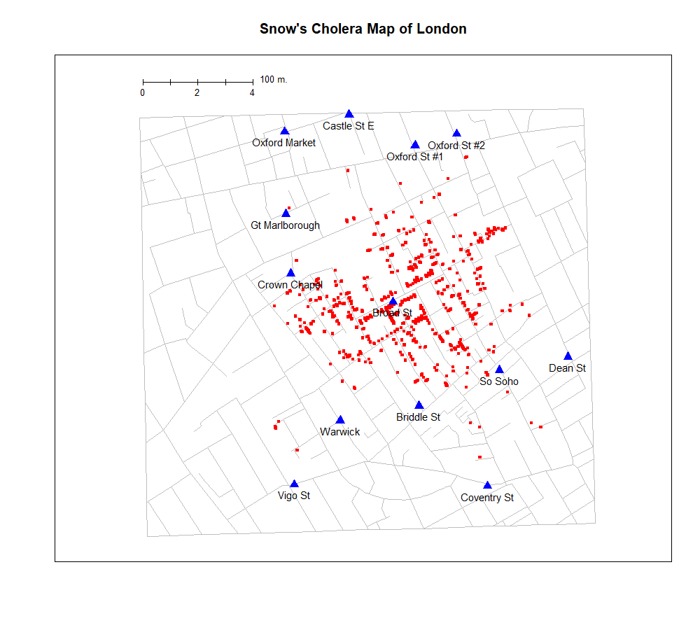
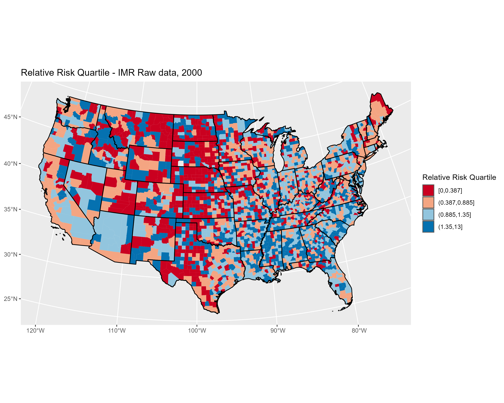
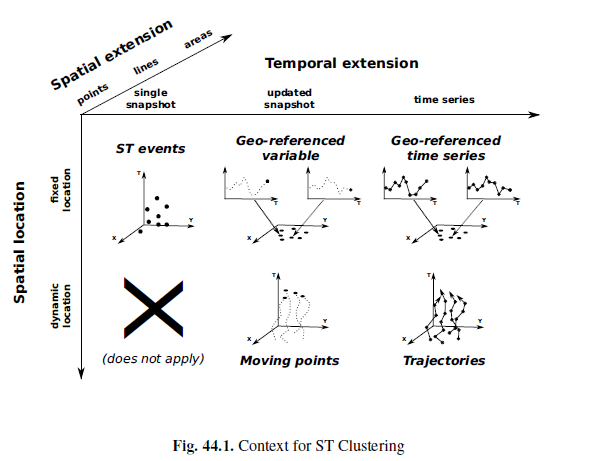
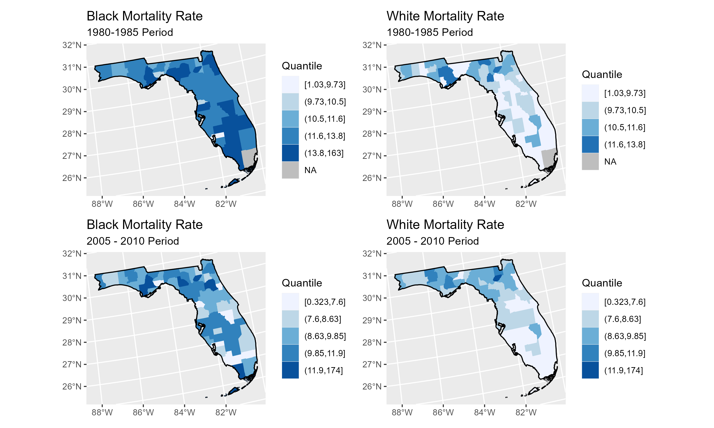

```{r, echo=FALSE, warning=FALSE, message=FALSE}
library(tidyverse, quietly = T)
library(sf, quietly = T)
```


## Presentation Structure

- Spatial and temporal demography
- Data sources
- Modeling strategies
- Empirical analysis of Florida mortality rates
- Results & visualizations
- Wrap up
```{r setup, include=FALSE}
knitr::opts_chunk$set(dpi=100, fig.height = 8, fig.width = 10)
```

---

##Beyond maps...

.center[]

---
class: center, inverse

.center[]

---
class: center, inverse

.center[]

---

## Spatial Demography

-  "Putting people into place" (Entwisle, 2007)
  + Need to think about:
  + Context
  + Dynamics
  + Processes

--

- Macro - demography (Voss, 2007)
  + Places as observations
  + Pre - 1960's
  + Ecological inference
 
--

- Micro - demography
  + People as observations
  + Social theory
  + Individual choices
  
--

- Multilevel - demography
  + People in places
  + Interaction between context and behavior


---

## Space & Time

- [Future directions in spatial demography](https://escholarship.org/uc/item/7xx3k2z4) report
  + Most participants listed time or temporal data as integral to the future of the field


--
- Time allows for dynamics of humans and environment
  + Snap shots/cross sections tell us nothing of this


---
class: center, middle
## Space & Time data models 




[Kisilevich et al 2010](https://link-springer-com.libweb.lib.utsa.edu/chapter/10.1007/978-0-387-09823-4_44)

---

## Complexities

- Humans, I mean c'mon
```{r, echo=FALSE,warning=FALSE, message=FALSE, out.width="75%"}
library(ggplot2); library(cowplot)

p1<-ggdraw()+draw_image("hurricane.jpg", scale = .9)
p2<-ggdraw()+draw_image("hwy.jpg", scale = .9)
p3<-ggdraw()+draw_image("border.jpg", scale = .9)
library(patchwork)

plot_grid(p1+ p2, p3, nrow=2)

```


---

## Complexities

- Data sources ?
  + Surveys
  + __Administrative data__

--
- Data management
  + Combining and merging data 

--
- Analysis/methods
  + Problems with space
  + Problems with time


--
- Advantages
  + Rich, dynamic contexts
  + Policy relevance of timely, prospective analysis
  
---

## Data sources

- NCHS/CDC

--
- Census/ACS

--
- DHS

--
- IPUMS

--
- International agencies

--
- Various administrative orgs.
  + State government
  + Private companies/Nonprofits
  

---

## How to combine these things?

- Geocodes are essential
  + Limitation for many surveys

--

- **Caveats**
- Levels of geography
  + The evil tracts
- MAUP
- Changing boundaries

- Analytically
  + Lots of ways, but are they all ideal?
  + These data can often be *very* large in size
  
---

## Hierarchical Models

- Allow for nesting of individuals by many different levels
 + People within places, within time periods

- Different types of outcomes
  + Continuous/discrete observations/outcomes
  
- Can include correlation between higher level units
  + Autocorrelation between places/time periods

- Dynamic modeling
  + Place - specific time trends for example

---

## Empirical example
- US County Mortality Rates
- NCHS [Compressed Mortality File](http://www.cdc.gov/nchs/data_access/cmf.htm)
    + County - level counts of deaths by year, age, sex, race/ethnicity and cause of death
    + 1980 to 2010
    + Age, sex and race _(white & black)_ specific rates for all US counties
    + In total: `r scales::label_comma(accuracy = 1)(8776385+9691181+17280710) ` deaths in the data
    + Standardized to 2000 Standard US population age structure
    + Rates stratified by race and sex for each county by year
    + n = 2 sexes $*$ 2 races $*$ 3106 counties $*$ 31 years = `r scales::label_comma(accuracy = 1)(2*2*31*3106)` observations 
    + *Analytic* n = 315,808 nonzero rates

--

- You can basically get these data from the CDC Wonder [website](http://wonder.cdc.gov/mortsql.html)
- Suppresses counts where the number of deaths is less than 10
- Rates are labeled as "__unreliable__" when the rate is calculated with a numerator of 20 or less
    + Big problem for small population counties
    + Still a problem for large population counties!
    
--

- Restricted use data allows access to __ALL__ data


---

## Data example 
```{r echo=FALSE, warning=FALSE, fig.height=8, fig.width=10}
library(knitr)
load("talk326.Rdata")
#sdadata2$year<-sdadata2$year
sdadata2$mortality<-sdadata2$std_rate
sdadata2$race_sex<-factor(ifelse(sdadata2$black==1&sdadata2$male==0, "Black Female",
                            ifelse(sdadata2$black==1&sdadata2$male==1, "Black Male",
                                   ifelse(sdadata2$black==0&sdadata2$male==0, "White Female","White Male"))))
sdadata2<-sdadata2[order(sdadata2$cofips, sdadata2$year, sdadata2$male, sdadata2$black), ]

bex1<-sdadata2[sdadata2$cofips=="12125", c("cofips","year", "race_sex", "mortality")] ; bex1<-bex1[is.na(bex1$cofips)==F,]
mon1<-sdadata2[sdadata2$cofips=="12073", c("cofips","year", "race_sex", "mortality")];mon1<-mon1[is.na(mon1$cofips)==F,]
library(knitr)
knitr::kable(head(mon1, n=12), row.names = F,
             col.names = c("County", "Year", "Race-Sex", "Rate"),
             align = "c")
```

---

County specific temporal trends 1980 - 2010

```{r, message=FALSE,results='hide',echo=FALSE, fig.width=8, fig.height=6, warning=FALSE}
bex1$race<-substr(bex1$race_sex,1,5)
library(ggplot2)
p1<-ggplot(bex1,aes(year,mortality),xlab="Year",ylab="Mortality Rate")+
  geom_line(aes(colour=race_sex ) , lwd=1.25)+
  ylab("Mortality Rate per 1,000")+
  xlab("Year")+
  ggtitle("Union County, FL, 1980 - 2010")+
  ylim(c(0, 25))+theme(legend.position="none")+
  scale_color_brewer(type="qual", "Set1")

p2<-ggplot(mon1,aes(year,mortality),xlab="Year")+geom_line(aes(colour=race_sex), lwd=1.25)+ylab("")+xlab("Year")+ggtitle("Leon County, FL, 1980 - 2010")+ylim(c(0,25))+scale_color_brewer(type="qual", "Set1")+theme(legend.text=element_text(size=8),
        legend.title = element_blank())

library(patchwork)
p1+p2 +plot_layout()


```

---

## Florida Example
- n = 67 counties $*$ 31 years $*$ 2 Races $*$ 2 Sexes = `r scales::label_comma(accuracy = 1)(67*31*2*2) `

```{r,results='hide',echo=FALSE, message=FALSE, warning=FALSE}
library(maptools)
library(tigris)

spdat<- counties(cb=T, refresh=T)
sts<- states(cb=T)
spdat$GEOID10<-paste(spdat$STATEFP,spdat$COUNTYFP,sep = "")
#plot(spdat)
sdadata2$state<-substr(sdadata2$cofips,1,2)
meansw<-aggregate(std_rate~cofips, data=sdadata2[sdadata2$black==0&sdadata2$year%in%1980:1985,], mean, na.rm=T)

meansb<-aggregate(std_rate~cofips, data=sdadata2[sdadata2$black==1&sdadata2$year%in%1980:1985,], mean, na.rm=T)
names(meansb)<-c("cofips", "std_rate_bl")
#mdat<-spdat@data
library(tigris)
mdat<- geo_join(spdat, meansw, by_sp="GEOID10",by_df="cofips" )
mdat$whmort<-mdat$std_rate
mdat<-geo_join(mdat, meansb,by_sp="GEOID10",by_df="cofips")
mdat$blmort<-mdat$std_rate_bl

# meansw<-aggregate(std_rate~cofips, data=sdadata2[sdadata2$black==0&sdadata2$year%in%2005:2010,], mean, na.rm=T)
# 
# meansb<-aggregate(std_rate~cofips, data=sdadata2[sdadata2$black==1&sdadata2$year%in%2005:2010,], mean, na.rm=T)
# names(meansb)<-c("cofips", "std_rate_bl")
#mdat<-spdat@data
library(tigris)
sts<- states(cb=T)
mdat<- geo_join(spdat, meansw, by_sp="GEOID10",by_df="cofips" )
mdat$whmort<-mdat$std_rate
mdat<-geo_join(mdat, meansb,by_sp="GEOID10",by_df="cofips")
mdat$blmort<-mdat$std_rate_bl
msf<-st_as_sf(mdat)
sts<-st_as_sf(sts)
msf$wmort_q<-cut(msf$whmort, breaks = quantile(c(msf$whmort, msf$blmort), probs = seq(0,1,.2), na.rm = T),include.lowest = T)
msf$bmort_q<-cut(msf$blmort, breaks = quantile(c(msf$whmort, msf$blmort), probs = seq(0,1,.2), na.rm = T),include.lowest = T)

library(ggplot2);library(dplyr); library(forcats)
msf<-st_transform(msf, crs = 2163)
sts<-st_transform(sts, crs=2163)
msf<-msf%>%
  filter(!STATEFP%in%c("02","15", "72" ))
sts<-sts%>%filter(!STATEFP%in%c("02","15","60", "66","69", "72", "78"))%>%st_boundary()


p1<-ggplot() +
  geom_sf(data=msf[msf$STATEFP=="12", ],aes(fill = bmort_q, color=bmort_q)) +
  scale_fill_brewer("Quantile", palette = "Blues", na.value="grey") +
  scale_color_brewer("Quantile",palette = "Blues", na.value="grey")+
  geom_sf(data=sts[sts$STATEFP=="12",], color="black")+
  ggtitle(label = "Black Mortality Rate", subtitle = "1980-1985 Period")

# p<-ggplot() +
# geom_sf(data=msf,aes(fill = wmort_q, color=wmort_q)) +
# scale_fill_brewer(palette = "Blues") +
# scale_color_brewer(palette = "Blues")+
# geom_sf(data=sts, color="black")

p2<-ggplot() +
  geom_sf(data=msf[msf$STATEFP=="12",],aes(fill = wmort_q, color=wmort_q)) +
  scale_fill_brewer("Quantile", palette = "Blues", na.value="grey") +
  scale_color_brewer("Quantile", palette = "Blues", na.value="grey")+
  geom_sf(data=sts[sts$STATEFP=="12",], color="black")+
  ggtitle(label = "White Mortality Rate", subtitle = "1980-1985 Period")

p3<-p1+p2 +plot_layout( )
ggsave(p3, filename="fig1.png", height = 8, width = 10, dpi = "print")

```
```{r, echo=F, results='hide', warning=FALSE}
meansw<-aggregate(std_rate~cofips, data=sdadata2[sdadata2$black==0&sdadata2$year%in%2005:2010,], mean, na.rm=T)

meansb<-aggregate(std_rate~cofips, data=sdadata2[sdadata2$black==1&sdadata2$year%in%2005:2010,], mean, na.rm=T)
names(meansb)<-c("cofips", "std_rate_bl")
#mdat<-spdat@data
library(tigris)
sts<- states(cb=T)
mdat<- geo_join(spdat, meansw, by_sp="GEOID10",by_df="cofips" )
mdat$whmort<-mdat$std_rate
mdat<-geo_join(mdat, meansb,by_sp="GEOID10",by_df="cofips")
mdat$blmort<-mdat$std_rate_bl
msf<-st_as_sf(mdat)
sts<-st_as_sf(sts)
msf$wmort_q<-cut(msf$whmort, breaks = quantile(c(msf$whmort, msf$blmort), probs = seq(0,1,.2), na.rm = T),include.lowest = T)
msf$bmort_q<-cut(msf$blmort, breaks = quantile(c(msf$whmort, msf$blmort), probs = seq(0,1,.2), na.rm = T),include.lowest = T)

library(ggplot2);library(dplyr); library(forcats)
msf<-st_transform(msf, crs = 2163)
sts<-st_transform(sts, crs=2163)
msf<-msf%>%
  filter(!STATEFP%in%c("02","15", "72" ))
sts<-sts%>%filter(!STATEFP%in%c("02","15","60", "66","69", "72", "78"))%>%st_boundary()


p3<-ggplot() +
  geom_sf(data=msf[msf$STATEFP=="12", ],aes(fill = bmort_q, color=bmort_q)) +
  scale_fill_brewer("Quantile", palette = "Blues", na.value="grey") +
  scale_color_brewer("Quantile",palette = "Blues", na.value="grey")+
  geom_sf(data=sts[sts$STATEFP=="12",], color="black")+
  ggtitle(label = "Black Mortality Rate", subtitle = "2005 - 2010 Period")

# p<-ggplot() +
# geom_sf(data=msf,aes(fill = wmort_q, color=wmort_q)) +
# scale_fill_brewer(palette = "Blues") +
# scale_color_brewer(palette = "Blues")+
# geom_sf(data=sts, color="black")

p4<-ggplot() +
  geom_sf(data=msf[msf$STATEFP=="12",],aes(fill = wmort_q, color=wmort_q)) +
  scale_fill_brewer("Quantile", palette = "Blues", na.value="grey") +
  scale_color_brewer("Quantile", palette = "Blues", na.value="grey")+
  geom_sf(data=sts[sts$STATEFP=="12",], color="black")+
  ggtitle(label = "White Mortality Rate", subtitle = "2005 - 2010 Period")

pa<-(p1+p2) /(p3+p4) +plot_layout( )
ggsave(pa, filename="fig2.png", height = 6, width = 10, dpi = "print")
#

```


---

## Methods - Bayesian Hierarchical models

* Example case of Florida counties
* Examine county-specific time trends in Black/White mortality rates
* I specify a Bayesian Hierarchical model for the age-standardized mortality rate 
* Controls for sex and county SES
* Spatial correlation in overall rate $u_j$
* Time varying Black/white disparity parameter $\nu_{t2}$
* Spatially varying Black/White disparity parameter $\gamma_j$

$$
\begin{aligned}
\operatorname{y}_{ij} &\sim N\left( \mu, \tau_y \right) \\
& \mu_{ij} = \beta_{0} + x'\beta +\gamma_j*Black + u_j +\nu_{t1} +  \nu_{t2}* Black  \\
& \gamma_j \sim \text{CAR}(\bar \gamma_j, \tau_{\gamma}/n_j) \\
&  u_j \sim \text{CAR}(\bar u_j, \tau_u /n_j)\\
& \nu_{t2} \sim RW1(time)\\
& \nu_{t1} \sim N(0, \tau_t) \\
\end{aligned}
$$


---

## Methods - Bayesian analysis
* This type of model is commonly used in epidemiology and public health
* Various types of data likelihoods may be used
* Need to get at:

*$$p(\theta|y) \propto p(y|\theta)p(\theta)$$

* Traditionally, we would get $p(\theta|y)$ by:
    + either figuring out what the full conditionals for all our model parameters are (hard)
    + Use some form of MCMC to arrive at the posterior marginal distributions for our parameters (time consuming)

---

## Methods - INLA approach
* [Integrated Nested Laplace Approximation](http://www.math.ntnu.no/~hrue/r-inla.org/papers/inla-rss.pdf) - Rue, Martino & Chopin (2009)
* One of several techniques that approximate the marginal and conditional posterior densities
    + Laplace, PQL, E-M, Variational Bayes
* Assumes all random effects in the model are latent, zero-mean Gaussian random field, $x$ with some precision matrix
    + The precision matrix depends on a small set of hyperparameters
* Attempts to construct a joint Gaussian approximation for $p(x | \theta, y)$
    + where $\theta$ is a small subset of hyper-parameters

---

## Methods - INLA approach
* Apply these approximations to arrive at:
* $\tilde{\pi}(x_i | y) = \int \tilde{\pi}(x_i |\theta, y)\tilde{\pi}(\theta| y) d\theta$

* $\tilde{\pi}(\theta_j | y) = \int \tilde{\pi}(\theta| y) d\theta_{-j}$

* where each $\tilde{\pi}(. |.)$ is an approximated conditional density of its parameters

* Approximations to $\pi(x_i | y)$ are computed by approximating both $\pi(\theta| y)$ and $\pi(x_i| \theta, y)$ using numerical integration to integrate out the nuisance parameters. 
    + This is possible if the dimension of $\theta$ is small.
* Approximations to $\tilde{\pi}(\theta|y)$ are based on the Laplace appoximation of the marginal posterior density for $\pi(x,\theta|y)$
* Their approach relies on numerical integration of the posterior of the latent field, as opposed to a pure Gaussian approximation of it

---

## INLA in R
`library(INLA)`

`std_rate~male+black+scale(lths)+`

`  f(year2, model = "rw1",constr = T, scale.model = T)+`

`   f(struct, model="besag", graph="cl_graph", constr = T, scale.model = T)+`

`   f(year3, bl2,  model="iid")+`

`   f(struct2, bl2, model="besag", graph="cl_graph", constr = T, scale.model = T)`

---

## Results
- Time trend in Black/white Mortality
```{r, echo=FALSE, message=FALSE}
library(INLA)
fl<- filter(sdadata2, state==12)
# mod<- std_rate~male+black+year+
#   f(year2,model="iid")+f(conum, model="iid")
# fit <- inla(mod,data=fl, family="gaussian",
#             control.predictor = list(link=1, compute=T), verbose=FALSE  )

fls<-counties(state="FL", cb=T)
fls$struct<-1:dim(fls)[1] 
nbs<-spdep::poly2nb(fls)
mat <- spdep::nb2mat(nbs, style="B",zero.policy=TRUE)
colnames(mat) <- rownames(mat) 
mat <- as.matrix(mat[1:dim(mat)[1], 1:dim(mat)[1]])


fl<-left_join(fl, fls, by =c("cofips"="GEOID"))
fl$year2<-fl$year-1995
fl$year3<-fl$year
fl$bl2<-fl$black
fl$struct2<-fl$struct
fl$int <- as.numeric(interaction(fl$year, fl$cofips))

spdep::nb2INLA("cl_graph",nbs)
am_adj <-paste(getwd(),"/cl_graph",sep="")
#H<-inla.read.graph(filename="cl_graph")

mod2<-std_rate~male+black+scale(lths)+
  f(year2, model = "rw1",constr = T, scale.model = T)+
f(struct, model="besag", graph="cl_graph", constr = T, scale.model = T)+
#f(int, model="iid")+
f(year3, bl2,  model="iid")+
  f(struct2, bl2, model="besag", graph="cl_graph", constr = T, scale.model = T)

fit2 <- inla(mod2,data=fl,
             family="gaussian",
            control.predictor = list(link=1, compute=T),
            verbose=F )

#summary(fit2)


fl$fittedm2<-fit2$summary.fitted.values$mean
options(dplyr.summarise.inform = FALSE)
```

```{r, echo=FALSE, message=FALSE, warning=FALSE, fig.width=8, fig.height=6}
fl%>%
  mutate(group = ifelse(black==1, "Black", "White"))%>%
  group_by(year, group)%>%
  summarise(mort = mean(fittedm2))%>%
  ggplot()+
  geom_line(aes(y=mort, x=year, color=group), lwd=2)+
   ylim(c(0, 25))+
  ggtitle("Black/White Mortality Rates in Florida", subtitle = "1980-2010")+
  scale_color_viridis_d(option="C")+ylab("Estimated Mortality Rate")+
  theme_minimal()
#  facet_wrap(~factor(group) )
```

---

## County time trends

```{r,echo=FALSE, message=FALSE, warning=FALSE, fig.width=10, fig.height=8}
fl%>%
  mutate(group = ifelse(black==1, "Black", "White"))%>%
  group_by(year, cofips, group)%>%
  summarise(mort = mean(fittedm2))%>%
  ggplot()+
  geom_line(aes(y=mort, x=year, color=cofips))+
  facet_wrap(~factor(group) )+
   ylim(c(0, 25))+
  scale_color_viridis_d(option="C")+
  ylab("Estimated Mortality Rate")+
  theme_minimal()+ylab("Estimated Mortality Rate")+
  theme(legend.position = "None")+
  ggtitle("Florida County - Specific Estimated Mortality Rates", subtitle = "1980-2010")

```

---
## Highlighed trends
```{r, echo=FALSE}
fl%>%
  mutate(group = ifelse(black==1, "Black", "White"))%>%
  filter(cofips %in% c(12073, 12086, 12099, 12125, 12067))%>%
  mutate(County=ifelse(cofips==12073, "Leon",
                   ifelse(cofips==12086, "Miami-Dade",
                          ifelse(cofips == 12125,"Union", 
                                 ifelse(cofips ==12067, "Lafayette", 
                                        "Palm Beach")))))%>%
  group_by(year, County, group)%>%
  summarise(mort = mean(fittedm2))%>%
  ggplot()+
  ylim(c(0, 25))+
  ylab("Estimated Mortality Rate")+
  geom_line(aes(y=mort, x=year, color=County), lwd=1.25)+
  facet_wrap(~factor(group) )+
  #scale_color_viridis_d(option="C")+
  theme_minimal()+
  ggtitle("Modeled Black/White Mortality Rates in Florida", subtitle = "1980-2010")
``` 
  
---
## Spatial trend

```{r, echo=FALSE}
fls$spre<- fit2$summary.random$struct$mean+ fit2$summary.fixed$mean[1]

fls%>%
  ggplot()+
  geom_sf(aes(fill=spre))+
  scale_fill_viridis_c()+
  ggtitle("Spatial Random Effect", subtitle = "Florida Counties")

```


---
## Spatial disparity

```{r, echo=FALSE}
fls$spre_bl<- fit2$summary.random$struct2$mean + fit2$summary.fixed$mean[1]+fit2$summary.fixed$mean[3]

fls%>%
  ggplot()+
  geom_sf(aes(fill=spre_bl))+
  scale_fill_viridis_c()+
  ggtitle("Spatial Random Effect of Black Disparity", subtitle = "Florida Counties")


```


---

## Discussion
* We see that, while there is a persistence of the gap in black-white mortality:
    + The mortality gap appears to be fairly consistent over time
    + In some areas, the mortality difference are decreasing
    + Results point to higher disparities in several notable Florida rural areas

* Spatio-temporal modeling allows for the incorporation of dynamics that cross-sectional models cannot
  
  
* INLA allows for rapid deployment of Bayesian statistical models with latent Gaussian random effects
    + Faster and *generally* as accurate as MCMC
    + Potentially an attractive solution for problems where large data/complex models may make MCMC less desirable

---

## Thank you!

[corey.sparks@utsa.edu](mailto:corey.sparks@utsa.edu)

[@Coreysparks1](http://twitter.com/CoreySparks1)

[UTSA Demography](http://hcap.utsa.edu/demography/)

Slides created via the [R](https://cran.r-project.org) package [**xaringan**](https://github.com/yihui/xaringan)

All talk materials available at my [Github page](https://github.com/coreysparks)

R-INLA examples available at my [Rpubs page](https://rpubs.com/corey_sparks)